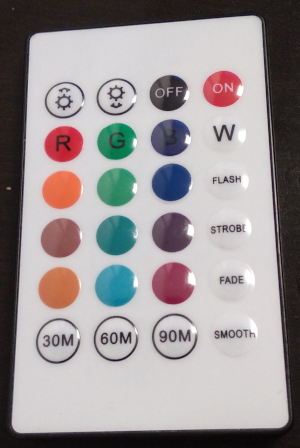

# NodeMCU ESP8266 IR Decoder
Found an only IR Remote that sends on 38KHz.   

  
Got myself the [CHQ1838 IR Reciever Module](http://www.datasheetcafe.com/chq1838-datasheet-infrared-receiver/) and started to investigate  

Apparently the remote sends 16 bits as 1640us pulses. The width of the ON or OFF pusle indicates the value.

## Pulse width detection
to avoid probing the signal using a busy loop we can use the *pulse widht detection* method outlined in the [NodeMCU Docs](https://nodemcu.readthedocs.io/en/release/modules/gpio/#example_3) that triggers for the first falling edge and then simply resets the trigger to next rising edge and so on.

|ON |     OFF|
|--|--|
|1225    |1245|
|1197    |431|
|412     |1216|
|413     |1215|
|412     |1215|
|413     |1215|
|384     |1243|
|412     |1216|
|385     |1243|
|412     |1215|
|1196    |432|
|1195    |433|
|1197    |431|
|1199    |430|
|1197    |431|
|1196    |432|

## Detected Codes

| Button | Code Hex|
|--|--|
|On | 0xFC02 |
|Off| 0xFD02 |
| Brightness Up | 0xFF00|
| Brightness Down | 0xFE01 |
